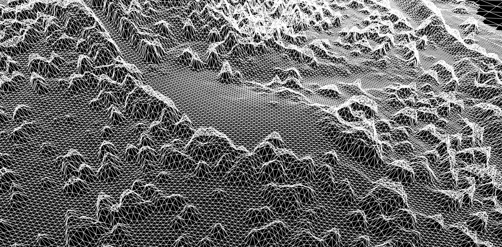
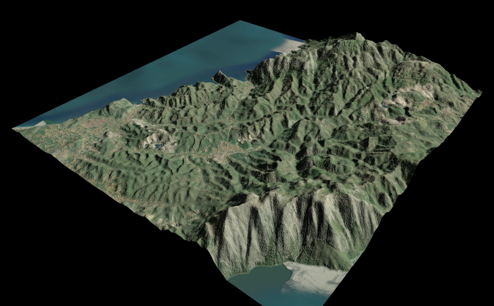

## Quick start

Note this is a reference only, one-shot project for a quick preview for my particular use case.
It involved some manual tiff recalculations using qgis, tiff alignment was done by a LLM so might be dumb.

quick writeup @ https://leshy.github.io/sunsim/

```sh
deno run build
deno run server
```



